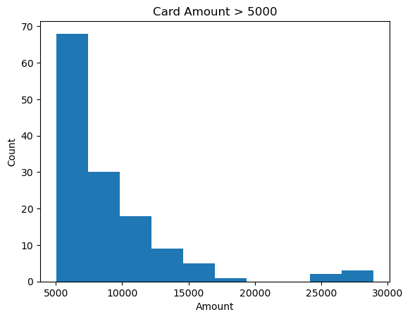
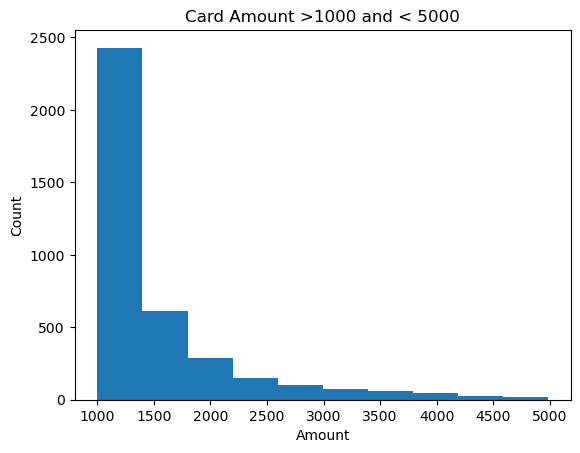

## Credit Card Fraud Detection

**Author**
Guduru, Thirupathi Reddy (https://github.com/trguduru)

### Executive summary

### Rationale
The rationale for detecting fraud in a credit card transaction is to eliminate the dollar waste for a financial institution. And also build trust with its customers.
### Research Question
Whether a given credit card transaction is a fraudulent transaction or not.

### Data Sources
The dataset for this use case is here - https://www.kaggle.com/datasets/kartik2112/fraud-detection .
This is simulated data using this simulation tool -  https://github.com/namebrandon/Sparkov_Data_Generation

This is a simulated credit card transaction dataset containing legitimate and fraudulent transactions from the duration of 1st Jan 2019 to 31st Dec 2020. It covers credit cards of 1000 customers doing transactions with a pool of 800 merchants.

### Methodology
I have used the following tools and techniques to classify whether a transaction is fraud or not in machine learning.
#### Data Analysis
This dataset has more than 1M rows and more than 20 features.To understand how each feature's data is and how they are related to each other have done the following analysis using various plots from *matplotlib* , *seaborn* and *plotly*.

 

#### Data Processing
* Cleaned some of the unnecessary columns like transaction number, merchant name, customer names etc, as these dont add any values in model evaluation.
#### Feature Engineering
* Added a few features like transaction hour from transaction date time, age from dob etc ...
* Applied *JamesSteinEncoder* for encoding categorical data
* Applied *StandardScaler* to scale the dependent features.
* Split the data with a test split size of 30% data.
#### Model Evaluation
Evaluated the following models
* LogisticRegression
* KNN
* DecisionTreeClassifier
* SVM
* GaussianNB
* SGDClassifier

### Results
After training all these models using **GridSearchCV** with 5 folds here are the results for various models.

 

### Next steps
Though the models have better classification scores the *true positive* prediction is very low which means these models classify every transaction as not a fraud which is not going to be very useful.

Here are a few additional techniques and/or algorithms we can use to further improve the model accuracy.

#### Data Balancing
The target class (is_fraud) is very imbalanced as fraud transactions are only 0.5% of the entire dataset of 1.2M.

Use the following techniques to balance this dataset.
* Random Over Sampling
* BorderlineSMOTE
* SMOTE
* ADASYN

#### Ensemble Models
Ensemble techniques and models might improve the accuracy of the models so we can try the following

* BaggingClassifier
* AdaBoostClassifier
* BalancedRandomForestClassifier
* RUSBoostingClassifier
* RandomForestClassifier

#### Neural Networks
Applying deep neural network *Dense* models along with cross-validation could also improve the accuracy.

### Outline of project

#### Project Organization
Here are various folder in this project contains the files of this project.
* data, it has train and test datasets
* images, contains various images of the data analysis and model performance plots etc ...
* jupyter notebook
* README
* git helper files
* vscode workspace

#### Deliverables
- [Jupyter Notebook](credit_card_fraud_detection.ipynb)

#### Library Requirements
To run this project you need to install the following libraries
* default anaconda environment
* intel sklearn extensions
* category_encoders

### Contact and Further Information
* Guduru, Thirupathi Reddy (https://github.com/trguduru)
